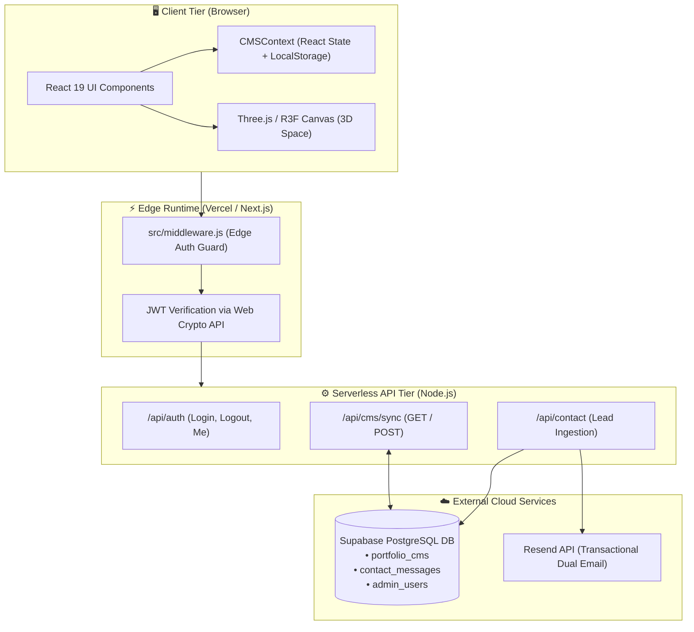
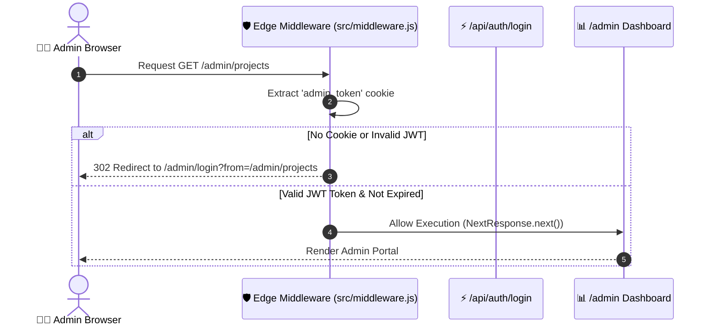
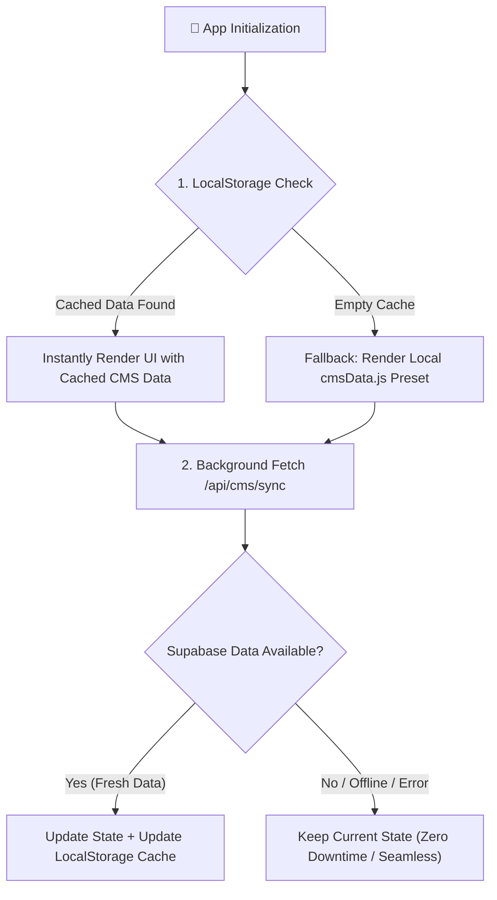
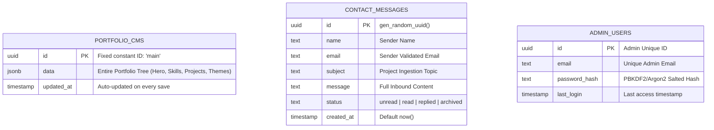
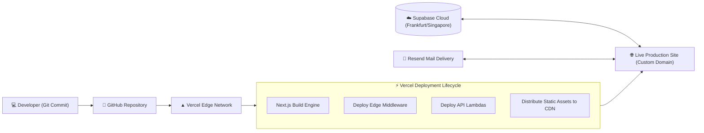

# 🚀 John Liton Mardy Portfolio
### Full-Stack Cyberpunk 3D Web Portfolio & Custom CMS Architecture
**Presenter:** John Liton Mardy  
**Role:** Full-Stack Web Developer & Software Engineer  
**Location:** Rajshahi, Bangladesh  
**Tech Stack:** Next.js 16 (App Router), React 19, Three.js, Supabase, Resend  

---

<!-- SLIDE 1 -->
# 📌 Agenda & Presentation Roadmap

1. **Executive Overview & Product Vision**
2. **System Architecture & High-Level Topology**
3. **Core Technology Stack & Runtime Dependencies**
4. **Project Directory & Modular Organization**
5. **Frontend & App Router Architecture**
6. **3D Interactive WebGL Graphics Engine**
7. **Global State Management & Hybrid Hydration**
8. **Built-in Headless CMS & Dynamic Theme Engine**
9. **Authentication, Edge Middleware & Security**
10. **Backend REST APIs & Data Flow Pipelines**
11. **Database Schema & Supabase Cloud Integration**
12. **Lead Generation & Resend Email Pipeline**
13. **End-to-End Workflow Diagrams**
14. **Git Branching Strategy & Environments**
15. **Local Setup, Deployment & Future Roadmap**

> 💡 *এই প্রেজেন্টেশনে পুরো কোডবেসের আর্কিটেকচার, প্রতিটি ফাইলের ভূমিকা, ডেটাবেস স্কিমা, সিকিউরিটি এবং স্টেপ-বাই-স্টেপ ওয়ার্কফ্লো বিস্তারিত তুলে ধরা হয়েছে।*

---

<!-- SLIDE 2 -->
# 🌌 Executive Overview: The Vision

### একটি সাধারণ পোর্টফোলিও সাইট বনাম এই সিস্টেম:

| ফিচার | সনাতন পোর্টফোলিও | John Liton Mardy Portfolio |
| :--- | :--- | :--- |
| **ইউজার এক্সপেরিয়েন্স** | সাধারণ স্ট্যাটিক এইচটিএমএল/সিএসএস | **Cyberpunk 3D Realtime Particle Universe (Three.js)** |
| **কন্টেন্ট আপডেট** | কোড এডিট ও রি-ডিপ্লয় বাধ্যতামূলক | **ফুল-ফিচার্ড ইন-বিল্ট Admin CMS (Zero-code updates)** |
| **ডেটা সিঙ্ক** | লোকাল স্টোরেজ অথবা হার্ডকোডেড | **Supabase PostgreSQL + LocalStorage হাইব্রিড সিঙ্ক** |
| **লিড ক্যাপচার** | ইমেইল লিংক (mailto:) | **DB-logged Contact & Hire Modal + Instant Dual Email (Resend)** |
| **থিমিং** | সাধারণ লাইট/ডার্ক মোড | **১২টি কাস্টম সাইবারপাঙ্ক নিয়ন থিম প্রিসেট** |
| **নিরাপত্তা** | নেই বললেই চলে | **Edge Middleware, JWT HMAC-SHA256, In-Memory Rate Limiter** |

> **মূল লক্ষ্য:** ভিজিটর ও ক্লায়েন্টকে প্রথম দেখাতেই অভিভূত (WOW) করা এবং ব্যাকএন্ডে একটি ফুল-স্কেল প্রোডাকশন-রেডি এন্টারপ্রাইজ সিস্টেম পরিবেশন করা।

---

<!-- SLIDE 3 -->
# 🏗️ High-Level System Architecture



---

<!-- SLIDE 4 -->
# 💻 Core Technology Stack

### ১. Frontend & Rendering
- **Next.js 16.3.5 (App Router):** SSR/SSG হাইব্রিড রেন্ডারিং, ফাস্ট রিফ্রেশ এবং সার্ভারলেস ব্যাকএন্ড।
- **React 19.2.8:** সর্বাধুনিক রিয়্যাক্ট কোর ও সার্ভার কম্পোনেন্টস সাপোর্ট।
- **CSS Modules & Global CSS:** নিয়ন গ্লো, গ্রিডলেআউট, সাইবারপাঙ্ক স্টাইলিং ও সিএসএস ভেরিয়েবলস।

### ২. 3D Graphics & Animations
- **Three.js (v0.186.0):** হাই-পারফরম্যান্স ওয়েবজিএল ইঞ্জিন।
- **@react-three/fiber (v9.7.0):** ডিক্লেয়ারিটিভ থ্রি.জেএস র‍্যাপার।
- **@react-three/drei (v10.7.8):** `AdaptiveDpr`, `Preload` অপটিমাইজেশন টুলকিট।
- **Framer Motion (v13.4.0) & GSAP (v3.15.0):** মাইক্রো-ইন্টারঅ্যাকশন ও পেজ ট্রানজিশন।

### ৩. Database, Services & Cryptography
- **Supabase (@supabase/supabase-js v2.116.0):** রিয়েলটাইম ক্লাউড পোস্টগ্রেস ডিবি।
- **Resend (v6.28.1):** অ্যাডমিন ও ক্লায়েন্টের জন্য ডুয়াল ট্রানজেকশনাল ইমেইল।
- **Web Crypto API:** Edge-র জন্য জিরো-ডিপেন্ডেন্সি আল্ট্রা-লাইটওয়েট HMAC-SHA256 JWT অ্যালগরিদম।

---

<!-- SLIDE 5 -->
# 📂 Project Structure & Directory Blueprint

```
john-liton-mardy-portfolio/
├── public/                     # Static assets (images, icons, resume PDF)
├── scripts/
│   └── test-responsiveness.mjs # Responsive breakpoint testing suite
├── src/
│   ├── middleware.js           # 🛡️ Edge-level route protection (/admin/*)
│   ├── app/
│   │   ├── layout.js           # Root HTML, Fonts, CMSProvider wrapper
│   │   ├── page.js             # Public Landing Page (7 Core Sections)
│   │   ├── globals.css         # Cyberpunk theme variables & keyframe animations
│   │   ├── admin/              # 🔐 Protected Backoffice CMS Pages
│   │   │   ├── page.js         # Admin Overview & Analytics Dashboard
│   │   │   ├── login/          # Cyber-terminal authentication portal
│   │   │   ├── messages/       # Inbound lead inbox & viewer
│   │   │   ├── theme/          # Live 12-theme switcher & color picker
│   │   │   ├── hero/about/...  # Granular section-by-section editors
│   │   └── api/                # ⚡ Serverless Endpoints (auth, cms, contact)
│   ├── components/             # Reusable UI & 3D WebGL modules
│   ├── context/CMSContext.jsx  # Global single source of truth for portfolio state
│   ├── data/                   # Default offline JSON data & 12 Theme Presets
│   └── lib/                    # Supabase client, Resend mailer, JWT Crypto
└── supabase_schema.sql         # Production database schema DDL
```

---

<!-- SLIDE 6 -->
# 🧭 Pages & Routing Architecture

### Public Routes vs Admin Backoffice:
```
🌐 Public Endpoints:
├── /                    --> Root Landing Page (Hero, About, Skills, Projects, Blog, Contact)
├── /blog/[slug]         --> Dedicated Dynamic Blog Post Reader
└── /api/*               --> Public & Protected REST API Routes

🔐 Admin Backoffice (/admin/*):
├── /admin/login         --> Cyberpunk Admin Sign-In (Rate-limited, Public)
├── /admin               --> Dashboard Summary (Quick Metrics, Message Counter)
├── /admin/messages      --> Client Leads Inbox (Status, Message Content, Delete/Mark)
├── /admin/theme         --> Preset Chooser & Custom Hex Color Palette Builder
├── /admin/hero          --> Headline, Subtitle, Typing Prompts, CTA Links
├── /admin/about         --> Bio, Philosophy, Stats Badges, Timeline
├── /admin/skills        --> Frontend, Backend, Tools & Proficiency Sliders
├── /admin/projects      --> Showcase Cards, Live URLs, GitHub repos, Tech Tags
├── /admin/experience    --> Career Milestones, Companies, Roles, Dates
├── /admin/blog          --> Article Creator & Editor
└── /admin/settings      --> Password Change, Admin Profile & Credentials
```

---

<!-- SLIDE 7 -->
# 🛡️ Security Layer: Edge Middleware & JWT

### Edge Runtime Route Protection (`src/middleware.js`):
- Next.js Edge Middleware ব্যবহার করে প্রতিটি `/admin/*` রিকোয়েস্ট ইন্টারসেপ্ট করা হয়।
- রিকোয়েস্টের HttpOnly কুকি থেকে `admin_token` রিড করা হয়।
- **Web Crypto API (HMAC-SHA256):** কোন ভারী এক্সটার্নাল লাইব্রেরি ছাড়া এজ-কম্প্যাটিবল ক্রিপ্টোগ্রাফিক ভ্যালিডেশন চলে।



---

<!-- SLIDE 8 -->
# 🪐 3D WebGL Graphics Engine

### আর্কিটেকচার (`src/components/3d/`):
- **`Scene.jsx`:** রিয়্যাক্ট থ্রি ফাইবার `<Canvas>` এর র‍্যাপার। এটি ডিভাইস ডিপিআর (`AdaptiveDpr`) হ্যান্ডেল করে ব্যাটারি ও জিপিইউ সেভ করে।
- **`ParticleField.jsx`:** হাজার হাজার কাস্টম নিয়ন পার্টিকেল তৈরি করে যা ইউজার মাউস মুভমেন্টের সাথে সাথে গ্র্যাভিটেশনাল ওয়েভের মত নড়াচড়া করে।
- **`HeroModel.jsx`:** কাস্টম ৩ডি নোড মেশ যা সাইবারপাঙ্ক ভাইব এনে দেয়।

```
  [Mouse Pointer Move] ──> [Normalized Screen Coords (-1 to +1)]
                                     │
                                     ▼
                [useFrame Loop (60-120 FPS smoothly damped)]
                                     │
                                     ▼
           [Particles BufferGeometry Pos X, Y, Z Dynamically Updated]
                                     │
                                     ▼
               [Hardware Accelerated WebGL Glow Shader Output]
```

---

<!-- SLIDE 9 -->
# 🔄 Global State & The Hybrid Hydration Flow

### সমস্যা: ক্লাউড ডিবি থেকে ডেটা আসার আগে কি ব্ল্যাঙ্ক পেজ দেখাবে?
### সমাধান: **3-Tier Fallback Hydration Engine (`CMSContext.jsx`)**



> **ফলাফল:** সাইট কখনও ফাঁকা বা লোডিং স্পিনারে আটকে থাকে না — আল্ট্রা-ফাস্ট ফার্স্ট কন্টেন্টফুল পেইন্ট (FCP)।

---

<!-- SLIDE 10 -->
# 🎨 12 Cyberpunk Themes & Dynamic Styling Engine

### থিম আর্কিটেকচার (`src/data/cmsData.js` & `globals.css`):
- কোনো রি-বিল্ড বা সিএসএস রি-কম্পাইল লাগে না।
- জাভাস্ক্রিপ্ট রানটাইমে ডাইনামিকালি `:root` সিএসএস ভেরিয়েবল ইনজেক্ট করে।

| # | থিম প্রিসেট নাম | প্রাইমারি কালার | অ্যাকসেন্ট কালার | ব্যাকগ্রাউন্ড টোন |
| :---: | :--- | :--- | :--- | :--- |
| **1** | **Cyberpunk Neon (Default)** | `#00f3ff` (Cyan) | `#ff003c` (Neon Red) | `#080811` (Deep Space) |
| **2** | **Matrix Green** | `#00ff41` (Terminal) | `#008f11` (Dark Matrix)| `#0d0208` (Obsidian) |
| **3** | **Synthwave Sunset** | `#ff71ce` (Pink) | `#01cdfe` (Sky Blue) | `#2b1055` (Retro Violet)|
| **4** | **Solar Flare** | `#ffaa00` (Amber) | `#ff3300` (Crimson) | `#140c02` (Charcoal) |
| **5** | **Tokyo Midnight** | `#9d4edd` (Purple) | `#00f5d4` (Teal) | `#0b091a` (Nightfall) |
| ... | **অন্যান্য ৭টি প্রিসেট** | *Emerald, Blood Moon, Frost, Cyber Gold, Dracula, etc.* |

---

<!-- SLIDE 11 -->
# 🎛️ The Content Management System (CMS)

### অ্যাডমিন প্যানেল মডিউলসমূহের কাজ:

```
┌─────────────────────────────────────────────────────────────────┐
│                    ADMIN BACKOFFICE DASHBOARD                   │
├───────────────┬─────────────────────────────────────────────────┤
│ Module        │ Live Editable Properties                        │
├───────────────┼─────────────────────────────────────────────────┤
│ 1. Hero       │ Name, Title, Bio Tagline, Typing Text, CTA Link │
│ 2. About      │ Long Bio, Story, Skill Highlights, Stats Badges │
│ 3. Skills     │ Tech Category, Skill Name, Icon, Mastery %      │
│ 4. Projects   │ Title, Description, Tech Stack Tags, Demo & Git │
│ 5. Experience │ Timeline, Company, Role, Responsibilities, Date │
│ 6. Blog       │ Markdown/HTML Content, Cover Image, Publish Tag │
│ 7. Theme      │ Live Color Picker + 12 Instant Preset Switcher  │
│ 8. Inbox      │ Contact Form Submissions, Client Budget & Email │
└───────────────┴─────────────────────────────────────────────────┘
```
> সব চেঞ্জ এক ক্লিকে সরাসরি **Supabase PostgreSQL**-এ সেভ হয়ে যায় এবং লাইভ সাইটে রিয়েল-টাইমে রিফ্লেক্ট করে!

---

<!-- SLIDE 12 -->
# 🔌 Serverless Backend API Layer

### ১. Authentication APIs:
- `POST /api/auth/login`: ভ্যালিডেশন, ব্রুট-ফোর্স রেট লিমিটিং, JWT টোকেন তৈরি ও HttpOnly কুকি সেট।
- `POST /api/auth/logout`: কুকি ইনভ্যালিডেশন ও সিকিউর সেশন ক্লিয়ার।
- `GET /api/auth/me`: বর্তমান অ্যাডমিন সেশন ও ক্রেডেনশিয়ালস ভেরিফিকেশন।

### ২. Content Management APIs:
- `GET /api/cms/sync`: ক্লাউড Supabase থেকে সম্পূর্ণ পোর্টফোলিও অবজেক্ট ফেচ করে।
- `POST /api/cms/sync`: অ্যাডমিন ড্যাশবোর্ড থেকে আপডেটকৃত পুরো কন্টেন্ট ডেটাবেজে মার্চ করে।

### ৩. Lead & Notification API:
- `POST /api/contact`: ভিজিটরের নাম, ইমেইল, সার্ভিস টাইপ, বাজেট ও মেসেজ রিসিভ করে; একই সাথে ডেটাবেজে লগ করে এবং নোটিফিকেশন ইমেইল ফায়ার করে।

---

<!-- SLIDE 13 -->
# 🗄️ Database Schema & Supabase Architecture



---

<!-- SLIDE 14 -->
# ✉️ Lead Generation & Resend Email Pipeline

```mermaid
sequenceDiagram
    autonumber
    actor Visitor as 👤 Client / Recruiter
    participant Modal as 💬 HireModal / ContactForm
    participant API as ⚡ /api/contact
    participant DB as 🗄️ Supabase (contact_messages)
    participant Resend as 📧 Resend API

    Visitor->>Modal: Submit Project Inquiry & Budget
    Modal->>API: POST /api/contact { name, email, subject, message }
    
    rect rgb(20, 30, 45)
        Note over API: Input Validation & Sanitization
        API->>DB: INSERT into contact_messages
        DB-->>API: Row Created (Status: unread)
    end

    par Parallel Email Dispatch
        API->>Resend: 📨 Alert Email to Admin (John Liton Mardy)
        API->>Resend: 📬 Professional Auto-Responder to Visitor
    end

    Resend-->>API: 200 OK (Dispatched)
    API-->>Modal: { success: true, message: "Sent successfully!" }
    Modal-->>Visitor: Show Cyberpunk Success Dialog
```



---

<!-- SLIDE 15 -->
# 🔄 Complete User Workflow 1: Public Visitor

```
[ Visitor Lands on / ]
          │
          ▼
[ 3D Scene Initializes (WebGL particle field attaches to mouse coordinates) ]
          │
          ▼
[ CMSContext automatically populates Hero, Skills, Projects, Blog ]
          │
          ▼
[ Visitor interacts with Projects, tests live demo links, filters skills ]
          │
          ▼
[ Visitor clicks 'Hire Me' or scrolls to Contact section ]
          │
          ▼
[ Submits HireModal with project brief, timeline, and email ]
          │
          ▼
[ Instant confirmation toast + Welcome auto-reply arrives in visitor's inbox ]
```

---

<!-- SLIDE 16 -->
# 🔄 Complete User Workflow 2: Admin Operations

```
[ Developer/Admin visits /admin ]
          │
          ▼
[ Edge Middleware catches request -> Redirects to /admin/login ]
          │
          ▼
[ Inputs Admin Password -> Rate Limiter checks attempt count ]
          │
          ▼
[ JWT Issued as HttpOnly Secure Cookie -> Redirects to /admin dashboard ]
          │
          ▼
[ Navigate to /admin/projects -> Add a new Project with tags & image URL ]
          │
          ▼
[ Click 'Save Changes' -> POST /api/cms/sync ]
          │
          ▼
[ Supabase 'portfolio_cms' table updated + LocalStorage updated ]
          │
          ▼
[ Live Portfolio website immediately shows the new project without rebuild! ]
```

---

<!-- SLIDE 17 -->
# 🌿 Git Branching Strategy & Multi-Branch Ecosystem

### রিমোট ও লোকাল ব্রাঞ্চ আর্কিটেকচার:

| ব্রাঞ্চের নাম | প্রকৃতি | ভূমিকা ও দায়িত্ব |
| :--- | :--- | :--- |
| `main` | **Production** | লাইভ প্রোডাকশন ডিপ্লয়মেন্ট ব্রাঞ্চ (Vercel-এ সংযুক্ত)। |
| `dev` | **Development** | সমস্ত ফিচার কম্বাইন করার সেন্ট্রাল ডেভেলপমেন্ট ওয়ার্কস্পেস। |
| `uat` | **Testing/Staging** | ইউজার অ্যাকসেপ্টেন্স টেস্টিং ও প্রি-রিলিজ ভেরিফিকেশন। |
| `admin-login` | **Feature Branch** | সুরক্ষিত অ্যাডমিন লগইন সিস্টেম, রেট লিমিটিং ও মিডলওয়্যার ইমপ্লিমেন্টেশন। |
| `feature-cms` | **Feature Branch** | সুপাবেজ ক্লাউড সিঙ্ক এবং ফুল সিএমএস আর্কিটেকচার ডেভেলপমেন্ট। |
| `feature-blog` | **Feature Branch** | ডাইনামিক ব্লগ সিস্টেম, এমডিএক্স/এইচটিএমএল রিডার ও আর্টিকেল ম্যানেজমেন্ট। |

> **প্র্যাকটিস:** ফিচার ব্রাঞ্চে কাজ শেষ হলে তা `dev`-এ মার্জ হয়, এরপর `uat`-এ টেস্ট হয়ে ফাইনালি `main`-এ প্রোডাকশন পুশ হয়।

---

<!-- SLIDE 18 -->
# ⚙️ Local Development & Quick Start Guide

### ১. ডিপেন্ডেন্সি ইনস্টল করুন:
```bash
git clone https://github.com/mardy-technology-ltd/john-liton-mardy-portfolio.git
cd john-liton-mardy-portfolio
npm install
```

### ২. এনভায়রনমেন্ট কনফিগারেশন (`.env.local`):
```ini
NEXT_PUBLIC_SUPABASE_URL=https://your-project.supabase.co
NEXT_PUBLIC_SUPABASE_ANON_KEY=your-anon-key
SUPABASE_SERVICE_ROLE_KEY=your-service-role-key
RESEND_API_KEY=re_your_resend_api_key
NOTIFICATION_EMAIL=your-email@domain.com
ADMIN_PASSWORD=your_super_secure_admin_password
JWT_SECRET=your_random_crypto_secret_32_characters_long
```

### ৩. লোকাল সার্ভার রান করুন:
```bash
npm run dev                # Dev server running on http://localhost:3000
npm run test:responsive    # Check responsive UI viewport breakpoints
```

---

<!-- SLIDE 19 -->
# 📱 Responsiveness, Mobile & GPU Optimization

### ১. অ্যাডাপটিভ ৩ডি পারফরম্যান্স:
- মোবাইল এবং লো-এন্ড জিপিউ ডিভাইসের জন্য `@react-three/drei` এর `AdaptiveDpr` ব্যবহার করা হয়েছে।
- ছোট স্ক্রিনে পার্টিকেলের ঘনত্ব অটোমেটিকালি অপ্টিমাইজ হয় যাতে কোনো ফ্রেম ড্রপ (lag) না হয়।

### ২. ফুল মোবাইল রেসপনসিভনেস:
- ফ্লুইড ফ্লেক্সবক্স ও গ্রিড লেআউট।
- মোবাইল হ্যামবার্গার মেনু ট্রানজিশন ও সাইবারপাঙ্ক স্লাইড-ইন ড্রয়ার।
- টাচ-ফ্রেন্ডলি মডালস ও অ্যাডমিন ফর্মস।
- অটোমেটেড ভেরিফিকেশন স্ক্রিপ্ট: `node scripts/test-responsiveness.mjs`।

---

<!-- SLIDE 20 -->
# 🚀 Production Deployment & DevOps Pipeline



---

<!-- SLIDE 21 -->
# 🛡️ Security Audit & Future Roadmap

### বর্তমান সিকিউরিটি শিল্ড:
- ✅ Edge-level Route Interception (Zero bypass to `/admin/*`).
- ✅ HttpOnly & Secure SameSite cookies (XSS protection).
- ✅ In-Memory Rate Limiting (Brute-force protection on `/api/auth/login`).
- ✅ PostgreSQL Row Level Security (RLS) policies on Supabase.

### ভবিষ্যৎ সংস্করণ (Future Upgrades):
- 🔹 **Direct Media Uploads:** Supabase Storage বা Cloudinary-র মাধ্যমে অ্যাডমিন প্যানেল থেকে সরাসরি ড্র্যাগ-অ্যান্ড-ড্রপ ইমেজ আপলোড।
- 🔹 **Multi-Language Support (i18n):** বাংলা এবং ইংরেজি দুই ভাষাতেই সম্পূর্ণ পোর্টফোলিও দেখার সুবিধা।
- 🔹 **AI Assistant Integration:** পোর্টফোলিওতে একটি এআই সাইবারপাঙ্ক চ্যাটবট যা জন লিটন মার্ডির কাজের অভিজ্ঞতার ভিত্তিতে রিয়েল-টাইমে ক্লায়েন্টদের প্রশ্নের উত্তর দেবে।

---

<!-- SLIDE 22 -->
# 🎯 Summary & Key Takeaways

1. **Enterprise-Grade Architecture:** সাধারণ স্ট্যাটিক পোর্টফোলিওর পরিবর্তে ফুল-স্ট্যাক নেক্সট.জেএস আর্কিটেকচার।
2. **Next-Gen Visuals:** থ্রি.জেএস পার্টিকেল ওয়েবজিএল এবং ১২টি ডাইনামিক সাইবারপাঙ্ক থিম।
3. **No-Code Admin Freedom:** কোড এডিট না করেই ব্রাউজার থেকেই টেক্সট, স্কিল, প্রজেক্ট এবং ব্লগ পরিবর্তন করার ক্ষমতা।
4. **Reliable Lead Funnel:** কন্টাক্ট এবং হায়ার মেসেজ কখনোই হারাবে না — ডেটাবেস লগিং ও তাৎক্ষণিক ইমেইল অ্যালার্ট।
5. **Rock-Solid Security:** এজ মিডলওয়্যার, স্টেটলেস ক্রিপ্টো জেডব্লিউটি ও রেট লিমিটিং।

---

# 👏 Thank You! Any Questions?

### John Liton Mardy
- 🌐 **Portfolio:** [johnlitonmardy.com](https://johnlitonmardy.com)
- 💼 **GitHub:** [github.com/mardy-technology-ltd](https://github.com/mardy-technology-ltd)
- 📧 **Email:** `contact@johnlitonmardy.com`
- 📍 **Rajshahi, Bangladesh**

---
